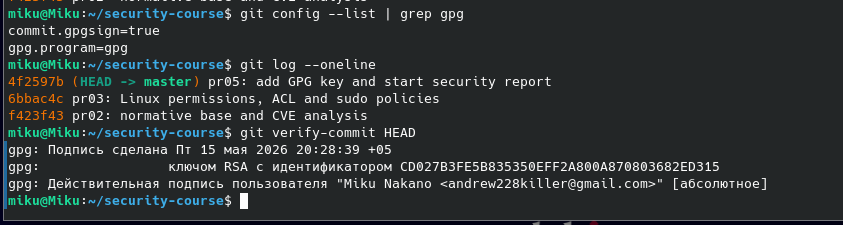
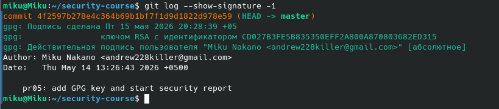

# ПР №5. GPG, подпись коммитов и безвозвратное удаление

## 1. GPG-ключевая пара

- Key-ID: 0A870803682ED315
- Тип: RSA 4096 бит
- Email: andrew228killer@gmail.com
- Размер публичного ключа: ~30 строк (ASCII-armor формат)

Что означает флаг --armor: преобразует бинарный ключ в текстовый формат Base64 (ASCII), что позволяет удобно копировать и передавать ключ через текстовые каналы (email, сайты, буфер обмена).

## 2. Шифрование

Зашифрованный файл (первые 5 строк):
```
-----BEGIN PGP MESSAGE-----

hQIMA20WCMnyFSP9AQ/+LXBPBtb0tgj+h8JD9rtFM17pnJuQtRn9JJMJb3kXksYn
Tw/PEhtpQq6w/FC7hEz4pigiq6R33Ks/VAIqJ4vi2JoVSdJlXjCWNDtTXER70ezX
UmkTG+vXQ6wJ7MKZmR/bCdzX9XAzgqrmUrB3I5rTG8HtbwZlvgfoHD0pFvBSuReC
...
```

Можно ли прочитать исходные данные из зашифрованного файла: Нет. Без приватного ключа и пароля содержимое нечитаемо — выглядит как случайный набор символов.

Что произойдёт если ввести неверный пароль при расшифровке: GPG выдаст ошибку "Bad session key" или "decryption failed" и откажет в расшифровке.

Почему нельзя расшифровать файл зашифрованный для другого пользователя: Файл зашифрован публичным ключом получателя. Расшифровать его может только владелец соответствующего приватного ключа — у другого пользователя его нет.

## 3. Цифровая подпись

Вывод gpg --verify (Good signature):
```
gpg: Подпись сделана ...
gpg: Действительная подпись пользователя "Miku Nakano <andrew228killer@gmail.com>"
```

Вывод gpg --verify после изменения файла (BAD signature):
```
gpg: ВНИМАНИЕ: Подпись НЕ ДЕЙСТВИТЕЛЬНА!
gpg: BAD signature from "Miku Nakano <andrew228killer@gmail.com>"
```

Почему подпись перестала быть действительной после изменения файла: При подписании GPG вычисляет хэш файла и шифрует его приватным ключом. После изменения файла хэш меняется и не совпадает с сохранённым в подписи — подпись становится недействительной.

Что именно проверяет gpg --verify: Что файл не был изменён после подписания (целостность) и что подпись создана владельцем указанного ключа (подлинность).

## 4. Подпись коммитов




Ссылка на коммит: https://github.com/MikuNakano/security-course/commit/4f2597b

Вывод git log --show-signature -1:
```
commit 4f2597b...
gpg: Подпись сделана Пт 15 мая 2026 20:28:39 +05
gpg:                ключом RSA с идентификатором CD027B3FE5B835350EFF2A800A870803682ED315
gpg: Действительная подпись пользователя "Miku Nakano <andrew228killer@gmail.com>" [абсолютное]
Author: Miku Nakano <andrew228killer@gmail.com>
    pr05: add GPG key and start security report
```

Зачем проверять подпись локально если GitHub уже показывает Verified: GitHub проверяет подпись на своём сервере и доверяет своей копии ключа. Локальная проверка через `git verify-commit` позволяет независимо убедиться в подлинности коммита без доверия третьей стороне, что важно в серьёзных проектах.

## 5. rm vs shred

| Операция | Что происходит с данными на диске | Можно восстановить? |
|----------|----------------------------------|---------------------|
| rm       | Удаляется только запись в метаданных (inode), сами данные остаются на диске | Да, пока блоки не перезаписаны |
| shred    | Содержимое блоков перезаписывается случайными данными несколько раз | Нет (при правильном применении) |

Сценарий когда нужно затирать свободное место: При передаче, продаже или утилизации носителя (жёсткого диска, флешки), а также при увольнении сотрудника с доступом к конфиденциальным данным — чтобы ранее удалённые файлы нельзя было восстановить специальными программами.

## Выводы

В ходе практической работы были освоены базовые инструменты криптографической защиты информации:

1. **GPG-ключевая пара** — создана пара ключей RSA 4096 бит. Публичный ключ используется для шифрования и проверки подписи, приватный — для расшифровки и создания подписи. Флаг `--armor` позволяет экспортировать ключи в текстовом формате.

2. **Шифрование** — зашифрованный файл невозможно прочитать без приватного ключа. GPG обеспечивает конфиденциальность данных даже при перехвате файла.

3. **Цифровая подпись** — подпись подтверждает целостность и подлинность файла. Любое изменение файла делает подпись недействительной, что позволяет обнаружить подмену данных.

4. **Подписанные коммиты** — настройка `commit.gpgsign=true` позволяет каждому коммиту иметь криптографическую подпись. GitHub отображает зелёный бейдж Verified, подтверждая что коммит создан именно владельцем ключа.

5. **rm vs shred** — команда `rm` не уничтожает данные физически, а лишь удаляет ссылку на файл. Для безвозвратного удаления необходимо использовать `shred`, который перезаписывает блоки случайными данными.


Контрольные вопрросы
1. В чём разница между шифрованием и подписью? Можно ли одновременно зашифровать и подписать файл?
Шифрование обеспечивает конфиденциальность — скрывает содержимое файла от посторонних. Подпись обеспечивает подлинность и целостность — подтверждает кто создал файл и что он не был изменён. Да, можно одновременно: gpg --sign --encrypt -r EMAIL file.txt — файл будет и зашифрован, и подписан.

2. Почему публичный ключ можно раздавать всем, а приватный нельзя никому?
Публичный ключ только шифрует данные и проверяет подписи — с ним нельзя расшифровать или подписать ничего от вашего имени. Приватный ключ расшифровывает и создаёт подписи — тот кто им владеет, может читать ваши зашифрованные сообщения и подписывать документы от вашего имени.

3. Что произойдёт с зашифрованными данными если потерять приватный ключ?
Данные станут безвозвратно недоступны. Расшифровать их без приватного ключа математически невозможно — никакой пароль или резервная копия не помогут, если ключ утерян.

4. Можно ли подделать Verified коммит на GitHub не имея приватного GPG-ключа владельца?
Нет. Verified бейдж означает что подпись проверена криптографически. Без приватного ключа создать валидную подпись невозможно — попытка подделки даст либо отсутствие бейджа, либо бейдж Unverified.

5. Почему shred плохо работает на SSD? Что использовать вместо него?
SSD использует wear leveling — контроллер распределяет записи по разным ячейкам, чтобы они изнашивались равномерно. Из-за этого shred перезаписывает не те же физические ячейки, а новые — старые данные остаются нетронутыми. Вместо shred на SSD используют:
    • ATA Secure Erase (hdparm --security-erase) — встроенная команда диска
    • Полное шифрование диска (LUKS) с самого начала — тогда при удалении ключа данные становятся нечитаемы


6. Коллега говорит: «я отформатировал диск перед продажей — всё безопасно». Он прав?
Нет. Форматирование удаляет только файловую систему (таблицу разделов), но не затирает сами данные. Специальными утилитами (PhotoRec, TestDisk, Recuva) большую часть файлов можно восстановить за несколько минут. Для безопасной продажи нужно использовать shred, dd с /dev/urandom или ATA Secure Erase для SSD.

7. Чем отличается detach-sign (--detach-sign) от встроенной подписи (--sign)?


                          --sign             --detach-sign
Результат;Один файл: данные + подпись вместе  Два файла: исходный файл + отдельный .sig
Исходный файл: Изменяется (оборачивается)     Остаётся нетронутым
Применение: Текстовые сообщения, письма       Бинарные файлы, дистрибутивы, пакеты

