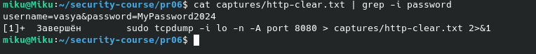
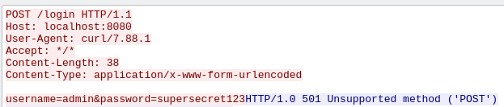

# ПР №6. Анализ сетевого трафика: tcpdump и Wireshark

## 1. Разбор строки tcpdump

Строка: `12:34:56.789012 IP 127.0.0.1.44321 > 127.0.0.1.8080: Flags [S], seq 123, length 0`

| Поле | Значение | Что означает |
|------|---------|-------------|
| 12:34:56.789012 | Временная метка | Точное время захвата пакета (часы:минуты:секунды.микросекунды) |
| IP | Протокол сетевого уровня | Пакет передаётся по протоколу IPv4 |
| 127.0.0.1.44321 | Адрес источника | IP-адрес и порт отправителя (клиент на локальной машине) |
| > | Направление | Пакет идёт от источника к получателю |
| 127.0.0.1.8080 | Адрес назначения | IP-адрес и порт получателя (сервер на локальной машине) |
| Flags [S] | TCP-флаг SYN | Начало TCP-рукопожатия — клиент инициирует соединение |
| seq 123 | Порядковый номер | Начальный sequence number пакета |
| length 0 | Длина данных | Пакет не содержит данных — только TCP-заголовок |

**Вывод:** это первый пакет TCP-рукопожатия (SYN). Клиент с порта 44321 подключается к серверу на порту 8080 на локальной машине.

---

## 2. Перехваченные данные HTTP

**Что видно в трафике:**
В захваченном HTTP-трафике в открытом виде видны: метод запроса (`POST /login HTTP/1.1`), заголовки (`Host`, `User-Agent`, `Content-Type`), а также тело запроса с учётными данными: `username=vasya&password=MyPassword2024`.

**Кто в реальной сети может так же прочитать этот трафик:**
- Интернет-провайдер (ISP)
- Системный администратор корпоративной сети
- Злоумышленник, подключённый к той же Wi-Fi сети (атака MITM — Man-in-the-Middle)
- Любой узел на пути между клиентом и сервером

---

## 3. Follow TCP Stream

**Что видит злоумышленник, перехвативший этот трафик:**
- Полный HTTP-диалог между клиентом и сервером
- Логин и пароль пользователя в открытом виде: `username=admin&password=supersecret123`
- URL и структуру сайта (адрес формы входа `/login`)
- Тип клиента (`User-Agent: curl/7.88.1`)
- Заголовки авторизации (`Authorization: Basic ...`)

**Скомпрометированные данные:** учётные данные пользователя, структура веб-приложения, тип используемого ПО.

---

## 4. HTTP vs HTTPS — сравнение

| Что наблюдаем | HTTP (порт 8080) | HTTPS (порт 443) |
|---|---|---|
| IP-адреса сторон | Видны | Видны |
| Порт назначения | Виден (8080) | Виден (443) |
| Заголовки HTTP | Видны | Скрыты (зашифрованы TLS) |
| Тело запроса (body) | Видно открытым текстом | Скрыто (зашифровано TLS) |
| Логин и пароль | Видны | Скрыты (зашифрованы TLS) |
| Имя домена | Видно в заголовке Host | Видно в SNI при TLS-рукопожатии |

**Вывод:** HTTPS шифрует всё содержимое передаваемых данных. Злоумышленник видит только IP-адреса, порты и имя домена (SNI), но не может прочитать данные.

---

## 5. DNS и приватность

**Какие домены видны в DNS даже при HTTPS:**
В DNS-запросах были видны домены: `github.com`, `example.com`, `google.com` — все их IP-адреса и время обращения фиксируются в открытом виде.

**Что это означает для приватности:**
Даже при использовании HTTPS DNS-запросы по умолчанию передаются без шифрования (порт 53, протокол UDP). Это означает что:
- Провайдер и сетевой администратор видят **все сайты**, которые посещает пользователь
- Содержимое страниц скрыто, но **факт посещения** — нет
- Решение: использовать **DNS over HTTPS (DoH)** или **DNS over TLS (DoT)**

---

## 6. Base64

**Декодированная строка:**
`dmFzeWE6TXlQYXNzd29yZDIwMjQ=` → `vasya:MyPassword2024`

**Почему Base64 не является шифрованием:**
Base64 — это способ кодирования данных, а не шифрования. Он не использует ключ и не защищает данные. Любой может декодировать Base64 без пароля или ключа, используя стандартную утилиту (`base64 -d`). HTTP Basic Authentication с Base64 даёт лишь иллюзию защиты — данные по-прежнему передаются в открытом виде и легко читаются при перехвате трафика.

---

## 7. tshark vs tcpdump

| Инструмент | Когда использовать |
|---|---|
| tcpdump | Быстрый захват трафика в терминале, на серверах без GUI, когда нужно сохранить pcap-файл для дальнейшего анализа |
| tshark | Анализ захваченных pcap-файлов в терминале, фильтрация по протоколам (HTTP, DNS и др.), статистика по протоколам, автоматизация и скриптинг |
| Wireshark | Интерактивный графический анализ трафика, удобный просмотр пакетов по уровням, Follow TCP Stream, цветовая разметка, работа на рабочей станции с GUI |

---

## 8. Каналы утечки через сеть

**Какие меры защиты закрывают сетевой канал утечки:**

1. **HTTPS вместо HTTP** — шифрует передаваемые данные через TLS, пароли и содержимое запросов становятся нечитаемы
2. **DNS over HTTPS (DoH) / DNS over TLS (DoT)** — скрывает имена посещаемых доменов от провайдера
3. **VPN** — шифрует весь трафик между устройством и VPN-сервером
4. **Сегментация сети и VLAN** — ограничивает возможность перехвата трафика внутри сети
5. **IDS/IPS системы** — обнаруживают аномальный трафик и попытки перехвата
6. **Политика запрета незашифрованных протоколов** — блокировка HTTP, FTP, Telnet на уровне межсетевого экрана

---

## Выводы

В ходе практической работы было наглядно продемонстрировано что HTTP-протокол передаёт все данные в открытом виде. С помощью tcpdump удалось перехватить логин и пароль (`vasya:MyPassword2024`) в реальном времени без каких-либо специальных инструментов.

HTTPS в отличие от HTTP шифрует содержимое трафика через TLS — при перехвате видны только IP-адреса и имя домена, но не данные.

Было также установлено что DNS-запросы при обычных настройках передаются без шифрования, что позволяет отслеживать посещаемые сайты даже при использовании HTTPS.

Base64-кодирование (используемое в HTTP Basic Auth) не является защитой — оно легко декодируется и не требует ключа.

**Главный вывод:** незашифрованные протоколы представляют серьёзную угрозу утечки данных. Сетевой канал утечки информации может быть использован злоумышленником, имеющим доступ к сетевому оборудованию или находящимся в той же сети.

10:05:44.158862 IP 127.0.0.1.54944 > 127.0.0.1.8080: Flags [S], seq 2268890236, win 65495, options [mss 65495, sackOK, TS val 3339462323 ecr 0, nop, wscale 7], length 0

| Поле | Значение | Что означает |
|---|---|---|
| `10:05:44.158862` | Время | Временная метка пакета |
| `IP` | Протокол | IPv4 |
| `127.0.0.1.54944` | Источник | Локальный IP + порт клиента |
| `>` | Направление | Пакет идёт от → к |
| `127.0.0.1.8080` | Назначение | Локальный IP + порт сервера |
| `Flags [S]` | TCP флаг | **SYN** — инициация соединения |
| `seq 2268890236` | Sequence number | Начальный порядковый номер пакета |
| `win 65495` | Window size | Размер буфера приёма |
| `mss 65495` | Max Segment Size | Максимальный размер сегмента |
| `sackOK` | SACK | Поддержка выборочных подтверждений |
| `TS val 3339462323` | Timestamp | Время отправки пакета |
| `ecr 0` | Echo reply | 0, так как это первый пакет (нет ответного времени) |
| `wscale 7` | Window Scale | Умножитель окна ×128 |
| `length 0` | Длина данных | Данных нет, только TCP-заголовок |

Пункт 23 ответ
HTTP не шифрует данные — всё передаётся как обычный текст
В реальной сети это может перехватить: системный администратор, провайдер, хакер в той же Wi-Fi сети (атака MITM)
Решение — использовать HTTPS, который шифрует трафик через TLS

Пункт 46 ответ
Злоумышленник видит:
- **URL:** `POST /login HTTP/1.1`
- **Хост:** `localhost:8080`
- **Логин:** `username=admin`
- **Пароль:** `password=supersecret123`
Скомпрометированы:
- Учётные данные пользователя (логин и пароль)
- Структура сайта (адрес формы входа)
- Тип браузера/клиента (User-Agent)

пункт 63 ответ
Вот заполненная таблица для отчёта:
| Что наблюдаем | HTTP (порт 8080) | HTTPS (порт 443) |
|---|---|---|
| IP-адреса сторон | Видны | Видны |
| Порт назначения | Виден (8080) | Виден (443) |
| Заголовки HTTP | Видны | Скрыты (зашифрованы) |
| Содержимое запроса (body) | Видно открытым текстом | Скрыто (зашифровано) |
| Логин и пароль | Видны | Скрыты (зашифрованы) |
| Имя домена (SNI) | Видно в Host: | Видно в SNI (до шифрования) |

Пункт 67 ответ
**Ответ для отчёта (пункт 67):**

В DNS-запросах видны домены:
- `github.com` → IP `140.82.121.4`
- `example.com` → IP `8.6.112.6`, `8.47.69.6`
- `google.com` → IP `108.177.14.138`, `108.177.14.139` и др.

**Что это означает для приватности при HTTPS:**

Даже если трафик зашифрован через HTTPS, DNS-запросы по умолчанию передаются **в открытом виде** (порт 53, без шифрования). Это значит что:

- Провайдер, системный администратор или злоумышленник в сети **видит все сайты которые ты посещаешь** — даже без расшифровки HTTPS
- Содержимое страниц скрыто, но **сам факт посещения** сайта не скрыт
- Решение — использовать **DNS over HTTPS (DoH)** или **DNS over TLS (DoT)**, которые шифруют DNS-запросы

Ответы на контрольные вопросы:
1. Promiscuous mode: Обычно сетевая карта принимает только пакеты адресованные ей. В promiscuous mode карта принимает все пакеты в сети, даже чужие. Снифферу это нужно чтобы перехватывать трафик других устройств, а не только свой.
2. Capture filter vs Display filter:
    • Capture filter — фильтрует трафик на этапе захвата, лишние пакеты вообще не записываются. Экономит память и место на диске. Синтаксис BPF (как в tcpdump).
    • Display filter — фильтрует уже захваченный трафик для отображения. Пакеты сохранены, просто скрыты. Более гибкий синтаксис Wireshark.
3. Follow TCP Stream: Функция Wireshark которая собирает все пакеты одного TCP-соединения и показывает их как единый диалог — что отправил клиент (красным) и что ответил сервер (синим). Используется для чтения HTTP-запросов, перехваченных паролей, передаваемых файлов целиком.
4. Base64 не защита: Base64 — это кодирование, а не шифрование. Не использует ключ, декодируется любым инструментом за секунду (base64 -d). Вместо HTTP Basic Auth нужно использовать HTTPS — тогда даже Base64 будет передаваться в зашифрованном TLS-туннеле и станет нечитаем при перехвате.
5. Что утекает при HTTPS:
    • IP-адреса клиента и сервера
    • Порт назначения
    • Имя домена через SNI (Server Name Indication) при TLS-рукопожатии
    • DNS-запросы если не используется DoH/DoT
Как исправить: использовать DNS over HTTPS (DoH) или DNS over TLS (DoT), а также VPN чтобы скрыть IP-адреса.
6. Сисадмин неправ: Свитч действительно отправляет трафик только нужному порту, но сниффинг всё равно возможен через:
    • ARP-spoofing — злоумышленник отравляет ARP-таблицы и трафик идёт через него
    • SPAN/mirror port — администратор сам может настроить зеркалирование трафика
    • MAC flooding — переполнение CAM-таблицы свитча превращает его в хаб
7. Фильтр tcpdump для DNS от конкретного IP:
sudo tcpdump -i ens33 src 192.168.1.50 and udp port 53
