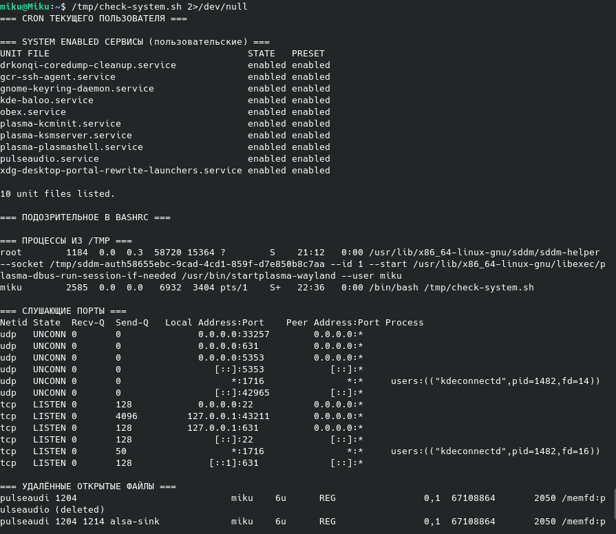

# ПР №8. Следы вредоносного ПО в Linux

## 1. Что было посажено

| Механизм | Место | Команда/файл |
|----------|-------|-------------|
| Cron | crontab пользователя root | /tmp/.hidden_malware/backdoor.sh & |
| Systemd | ~/.config/systemd/user/ | system-helper.service (запуск /tmp/.hidden_malware/backdoor.sh)|
| Shell profile | /root/.bashrc (строка 102) | /tmp/.hidden_malware/backdoor.sh & |
| Процесс | /tmp/.hidden_malware/ | listener.sh (PID 8068, 8118) и nc (PID 8068) на порту 4444 |

## 2. Что нашли — процессы

Команда: ps aux | grep '/tmp'
**Результат: **

```
root        8058  0.0  0.1   9728  3304 pts/0    S    22:45   0:00 /bin/bash /tmp/.hidden_malware/backdoor.sh
root        8067  0.0  0.1   9728  3192 pts/0    S    22:45   0:00 /bin/bash /tmp/.hidden_malware/listener.sh
root        8068  0.0  0.0   7480  2432 pts/0    S    22:45   0:00 nc -l -p 4444 -q 1
root        8117  0.0  0.1   9728  3192 pts/0    S    22:45   0:00 /bin/bash /tmp/.hidden_malware/listener.sh
root        8144  0.0  0.0   7288   896 pts/0    S    22:45   0:00 sleep 30
root        8152  0.0  0.0   7288   896 pts/0    S    22:45   0:00 sleep 1
```

**Что подозрительно:**

* **Каталог выполнения:** Активность процессов зафиксирована во временной директории `/tmp`. Данный каталог предназначен исключительно для краткосрочных данных сессий и открыт на запись любому пользователю, поэтому постоянная работа исполняемых скриптов оттуда является критической аномалией.
* **Маскировка (Сокрытие):** Использование директории со спецификатором точки (`.hidden_malware`) свидетельствует о намеренной попытке скрыть вредоносные файлы от стандартных инструментов обзора (команды `ls` без ключа `-a`).
* **Бесконечные циклы:** Наличие сопутствующих процессов `sleep 30` и `sleep 1` указывает на работу непрерывных фоновых циклов ожидания команд или удержания соединения.
* **Избыточность процессов:** В системе активны сразу две копии скрипта `listener.sh` (PID `8067` и PID `8117`). Это вызвано конфликтом механизмов автозапуска (планировщик Cron и служба Systemd отработали независимо). При этом у процесса `8118` отсутствует дочерний процесс `nc`, так как порт `4444` уже был монопольно занят первым экземпляром утилиты, из-за чего повторная команда завершилась с ошибкой связывания сокета.

## 3. Что нашли — сетевые соединения

Команда: ss -tulnp
Подозрительный порт: 4444
Процесс: [nc  PID 8068 И 8118]

Команда: sudo lsof -i :4444


Как lsof связывает порт с процессом: В Linux **«всё есть файл»**. Сетевой сокет — это тоже файл. Связующим звеном между ними выступает виртуальная файловая система **`/proc`**.
* **Шаг 1. Поиск номера сокета:** При выполнении `lsof -i :4444` утилита сначала заглядывает в сетевые таблицы ядра (например, `/proc/net/tcp`), находит там порт `4444` и считывает связанный с ним уникальный номер сокета (идентификатор инноды, например `29107`).
* **Шаг 2. Обход процессов в `/proc`:** Затем `lsof` сканирует папки абсолютно всех запущенных процессов в виртуальной файловой системе `/proc/[PID]/fd/`, где хранятся ссылки на все открытые ими файлы и дескрипторы.
* **Шаг 3. Сопоставление:** Утилита ищет, у какого именно процесса дескриптор ссылается на строку `socket:[29107]`. 
* **Результат:** Найдя совпадение в каталоге `/proc/8068/fd/3`, `lsof` связывает всё воедино и выводит строку: процесс `nc` (PID `8068`) держит порт `4444` через дескриптор файла `3u`.


## 4. Что нашли — автозапуск

### Cron


Что подозрительно: Запись @reboot осуществляет автоматическую инициализацию бэкдора сразу в момент старта операционной системы от имени суперпользователя root, минуя авторизацию. Директива */5 * * * * настроена на принудительный запуск скрипта каждые 5 минут. Это критический индикатор закрепления (Persistence): в случае, если администратор обнаружит и завершит процессы вредоносного ПО вручную, планировщик автоматически восстановит устойчивый канал связи в течение ближайших минут.

### Systemd


Что подозрительно:  
* Имя службы system-helper.service (Системный помощник) намеренно мимикрирует под штатные утилиты автоматизации Linux, чтобы не привлекать внимание при беглом анализе. Однако юнит расположен в локальном пользовательском каталоге (~/.config/systemd/user/), что позволяет ПО функционировать в обход глобального аудита системных демонов. Параметр ExecStart прямо указывает на скрытый скрипт в /tmp.
* Параметры Restart=always и RestartSec=10 обеспечивают повышенную живучесть: диспетчер служб systemd будет автоматически и циклически (каждые 10 секунд) поднимать упавший или принудительно убитый процесс бэкдора.

### ~/.bashrc
Строка которую нашли:

```
/tmp/.hidden_malware/backdoor.sh &
```

Где находится: Строка была локализована в конфигурационном файле интерактивной оболочки суперпользователя /root/.bashrc на 102-й строке. Данная модификация скрытно запускает бэкдор в фоновом режиме (&) каждый раз, когда администратор открывает новую сессию терминала или подключается к серверу под учетной записью root.
 

## 5. Итоговая таблица следов

| Место | Инструмент обнаружения | Что нашли |
|-------|----------------------|-----------|
| Процессы | ps aux | Дерево процессов backdoor.sh (PID 8068), listener.sh (PID 8068, 8118) и nc (PID 8068), функционирующих из каталога /tmp. |
| Порт 4444 | ss -tulnp/ lsof -i | Несанкционированный открытый сетевой сокет на порту 4444 в состоянии ожидания подключений (LISTEN). |
| Файлы процесса | lsof -p 8068 | Активный дескриптор чтения 255r на вредоносный файл /tmp/.hidden_malware/listener.sh. |
| Cron | crontab -l | Директивы автозапуска @reboot и циклического контроля */5 * * * * для удержания доступа. |
| Systemd | systemctl --user | Пользовательский сервис system-helper.service со статусом enabled и политикой агрессивного авторестарта. |
| Bashrc | grep -n | Внедрение несанкционированной команды запуска бэкдора на 102-й строке конфигурационного файла профиля /root/.bashrc. |


## 6. Связь с нормативкой

Какие меры ФСТЭК №17 реализует эта проверка:
- АНЗ.2 (Контроль состава и конфигурации информационной системы): Проведенный аудит реализует базовые принципы фиксации и контроля целостности установленной конфигурации ОС. Данные действия позволяют своевременно выявлять несанкционированные изменения в составе ПО (появление посторонних исполняемых файлов в каталогах общего доступа /tmp, регистрация скрытых служб автоматизации и нештатных конфигураций инициализации).
- АУД.4 (Анализ действий пользователей в информационной системе): Использование утилит трассировки дескрипторов и мониторинга процессов (ps, lsof) позволяет осуществлять аудит подозрительной активности в оперативной памяти и связывать запуск недоверенного кода со скомпрометированными учетными записями пользователей (в текущем сценарии — выполнение с максимальными привилегиями root).
- ЗИС.17 (Обеспечение контроля сетевых соединений): Периодический мониторинг сетевых интерфейсов и сокетов с помощью команд ss и lsof -i позволяет контролировать сетевой периметр хоста, оперативно обнаруживать скрытые каналы утечки информации (Reverse Shell), несанкционированные открытые порты (Bind Shell) и блокировать трафик, нарушающий внутреннюю политику безопасности.

## 7. Результаты зачистки и повторной проверки


* **Планировщик задач:** Раздел `=== CRON ТЕКУЩЕГО ПОЛЬЗОВАТЕЛЯ ===` пуст. Автозапуск через cron ликвидирован.
* **Службы автоматизации:** В разделе `=== SYSTEMD ENABLED СЕРВИСЫ ===` больше нет службы мимикрии `system-helper.service`. Остался только штатный легитимный сервис миграции сессий.
* **Профиль оболочки:** Секция `=== ПОДОЗРИТЕЛЬНОЕ В BASHRC ===` полностью очищена. Принудительный старт вредоносного кода при логине root-пользователя заблокирован.
* **Активность в памяти:** В разделе `=== ПРОЦЕССЫ ИЗ /TMP ===` остался только запущенный тобой в данный момент диагностический скрипт проверки. Сторонний вредоносный код в оперативной памяти больше не выполняется.
* **Сетевой периметр:** Из раздела `=== СЛУШАЮЩИЕ ПОРТЫ ===` полностью пропал подозрительный порт `4444`. Несанкционированные сетевые утилиты `nc` (Netcat) завершили свою работу, закрыв потенциальный канал удаленного управления (Reverse/Bind Shell).
* **Дескрипторы:** Секция `=== УДАЛЁННЫЕ ОТКРЫТЫЕ ФАЙЛЫ ===` пуста, а значит, скрытых зомби-процессов, удерживающих удаленный код в памяти, в системе не осталось.

## Выводы

В ходе выполнения лабораторной работы были освоены практические навыки выявления следов присутствия вредоносного по в оc семейства Linux. Были изучены методы анализа активных процессов, мониторинга открытых сетевых сокетов, а также проверки ключевых точек закрепления в системе на предмет несанкционированных изменений.

## Контрольные вопросы

### 1. Пять мест автозапуска в Linux и их привилегии
1. **`/etc/crontab` (или `/var/spool/cron/crontabs/root`)** — задачи планировщика Cron. Выполняются с максимальными привилегиями `root`.
2. **`/etc/systemd/system/`** — системные службы Systemd. Запускаются от имени `root` (если в юните явно не указан другой пользователь).
3. **`~/.config/systemd/user/`** — пользовательские службы Systemd. Выполняются строго с правами конкретного пользователя (не требуют `root`).
4. **`/etc/profile.d/` (или `/etc/profile`)** — глобальные скрипты профиля оболочки. Выполняются для любого пользователя при входе в систему (уровень привилегий зависит от того, кто авторизуется).
5. **`~/.bashrc` (или `~/.profile`)** — индивидуальный конфигурационный файл оболочки пользователя. Выполняется с правами владельца домашней директории при открытии терминала (например, `/root/.bashrc` даст права `root`).

### 2. Отличие `lsof` от `ss` и случаи их применения
* **`ss` (Socket Statistics):** Специализированная утилита для работы с сетью. Она напрямую и очень быстро опрашивает ядро о состоянии сетевых сокетов.
  * *Когда использовать:* Когда нужно быстро проверить сетевую активность, найти открытые порты, узнать статус соединений (`LISTEN`, `ESTABLISHED`) или отфильтровать трафик.
* **`lsof` (List Open Files):** Универсальная утилита, отображающая абсолютно все открытые процессы файлы (включая регулярные файлы на диске, пайпы, библиотеки и сокеты).
  * *Когда использовать:* Когда нужно глубокое расследование (форензика): связать сокет с конкретным файлом на диске, посмотреть какие библиотеки `.so` подгрузил процесс или найти удаленные, но удерживаемые в памяти исполняемые файлы.

### 3. Строка `(deleted)` в выводе `lsof`
* **Что означает:** Исполняемый файл вредоноса был физически удален с диска (например, командой `rm`) после запуска, но процесс все еще активен и удерживает код файла в оперативной памяти хоста.
* **Зачем используют вредоносы:** 1. **Сокрытие следов:** Заметание следов на диске — антивирусы и системные администраторы не смогут найти тело файла в файловой системе стандартными методами обзора (`ls`).
  2. **Защита от удаления:** Пока процесс удерживает дескриптор файла, код продолжает выполняться в памяти, усложняя анализ и удаление бэкдора до полной остановки процесса.

### 4. Пользовательский systemd-сервис в `~/.config/systemd/user/`
* **Нужен ли root:** **Нет**, права суперпользователя не требуются. Любой пользователь может создавать и включать (`enable`) сервисы в своем домашнем каталоге.
* **В чем опасность:** Это идеальный легитимный механизм закрепления для злоумышленника в случае компрометации даже беспривилегированной учетной записи. Ему не нужно повышать права до `root`, чтобы гарантировать автозапуск своего бэкдора при старте системы или входе пользователя.

### 5. Как отличить настоящий `systemd-journald` от поддельного
1. **По пути исполняемого файла:** Настоящий демон всегда запускается из системного каталога `/lib/systemd/systemd-journald` или `/usr/lib/...`. Поддельный будет запущен из нетипичных мест (например, `/tmp`, `/var/tmp` или `/home`). Проверяется через `ls -l /proc/[PID]/exe`.
2. **По родительскому процессу (PPID):** Настоящий `systemd-journald` запускается непосредственно системным менеджером `systemd` (PID 1). Подделка часто имеет в родителях интерпретаторы командной строки (`bash`, `sh`) или процессы планировщика `cron`.
3. **По открытым дескрипторам:** Настоящий журнал имеет открытые сокеты логирования (например, `/run/systemd/journal/stdout`), в то время как подделка может держать подозрительные сетевые соединения на внешние IP-адреса.


### 6. Однострочник для поиска исполняемых файлов в `/tmp` и `/var/tmp`

```
find /tmp /var/tmp -type f -executable 2>/dev/null
```
