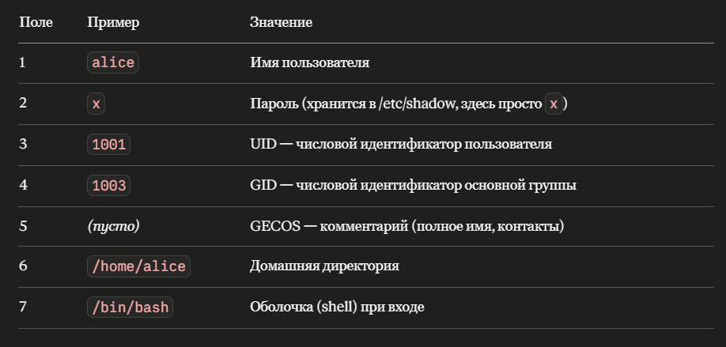
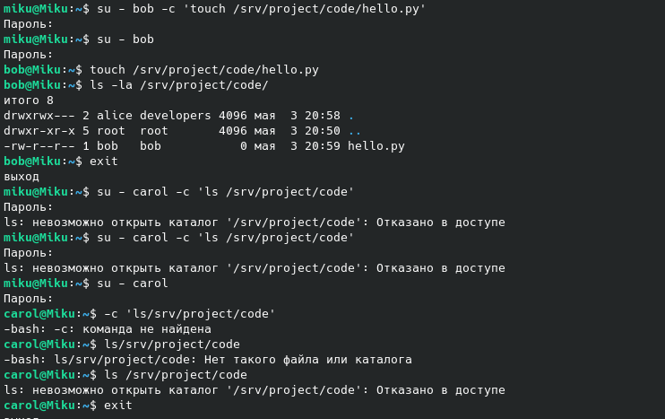
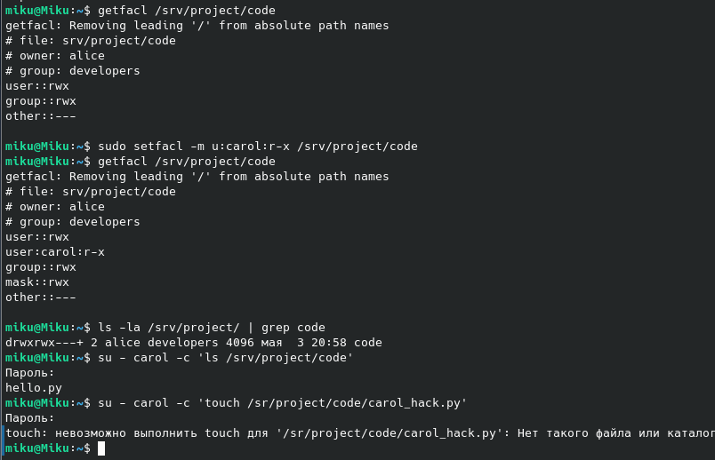

# ПР №3. Права доступа Linux и управление пользователями

## 1. Пользователи и группы

Созданные пользователи и их роли:

| Пользователь | Группа | Роль |
|---|---|---|
| alice | developers | Администратор проекта |
| bob | developers | Разработчик |
| carol | auditors | Аудитор |

### Разбор полей /etc/passwd

Пример строки: `alice:x:1001:1003::/home/alice:/bin/bash`

| № поля | Значение | Пример |
|---|---|---|
| 1 | Имя пользователя | alice |
| 2 | Пароль (x — хранится в /etc/shadow) | x |
| 3 | UID — числовой идентификатор пользователя | 1001 |
| 4 | GID — числовой идентификатор основной группы | 1003 |
| 5 | GECOS — комментарий (полное имя, контакты) | *(пусто)* |
| 6 | Домашняя директория | /home/alice |
| 7 | Оболочка (shell) при входе | /bin/bash |



### Файл /etc/shadow

В файле `/etc/shadow` хранятся: хэши паролей пользователей, дата последней смены пароля, минимальный и максимальный срок действия пароля, период предупреждения об истечении.

Файл недоступен обычным пользователям (права `-rw-r-----`, только root), потому что если любой пользователь мог бы читать хэши — злоумышленник мог бы подобрать пароль перебором (brute force).

---

## 2. Права доступа chmod/chown

Итоговые права `/srv/project/code`: `chmod 770`, владелец `alice:developers`

- **bob** (в группе developers): при правах `750` не смог создать файл, потому что группе было дано только чтение и выполнение (`r-x`), но не запись (`w`). После изменения на `770` — смог создать файл `hello.py`.
- **carol** (не в группе developers): не смогла войти в директорию, потому что права `770` не дают доступа остальным (`o = ---`).



### Права файла q1.txt

Файл `q1.txt` имеет права `640`, владелец `alice:auditors`:

**Числовая запись: `640`**
- `6` = 4+2 = владелец alice — чтение и запись (`rw-`)
- `4` = 4 = группа auditors — только чтение (`r--`)
- `0` = остальные — нет доступа (`---`)

**Символьная запись: `-rw-r-----`**

Carol смогла прочитать файл, потому что входит в группу `auditors`.

---

## 3. ACL — расширенные списки контроля доступа

**Задача:** дать carol право читать код, не меняя группу файлов.

**Команда:**
```bash
sudo setfacl -m u:carol:r-x /srv/project/code
```

Вывод `getfacl` после изменения:
```
# вставить вывод команды getfacl /srv/project/code
```



**Результаты проверки:**
- Carol смогла выполнить `ls /srv/project/code` — видит файлы ✓
- Carol не смогла создать `carol_hack.py` — Permission denied ✓

**Чем ACL лучше стандартной модели в данной ситуации:**  
Стандартная модель (user/group/other) не позволяет дать доступ конкретному пользователю без изменения группы файла. ACL решает эту проблему — можно задать права для произвольного числа пользователей независимо от их группы. В нашем случае carol получила доступ на чтение к папке `code` без добавления её в группу `developers`.

После удаления ACL командой `setfacl -x u:carol /srv/project/code` доступ carol снова закрылся.

---

## 4. sudo-политики

| Пользователь | Разрешено | Ограничение | NOPASSWD |
|---|---|---|---|
| alice | Всё (ALL) | Нет | Да |
| bob | /usr/bin/apt, /usr/bin/apt-get | Только пакетный менеджер | Да |
| carol | /usr/bin/journalctl, /bin/cat /var/log/* | Только просмотр логов | Да |


**Почему alice использует NOPASSWD, а ограничения у всех разные:**  
Alice — администратор, ей нужен быстрый полный доступ без лишних барьеров. Bob и carol получают только те права, которые нужны для их рабочих задач.

**Принцип безопасности:** реализован **принцип наименьших привилегий** (Least Privilege) — каждый пользователь получает ровно столько прав, сколько необходимо для выполнения его функций, и не больше. Это одна из ключевых мер защиты по Приказу ФСТЭК №17 (группа мер УПД).

---

## 5. PAM — подключаемые модули аутентификации

### Модуль pam_unix.so

В строке `auth required pam_unix.so` слово `required` — это **управляющий флаг** (control flag).

`required` означает: модуль обязателен для успешной аутентификации. Если `pam_unix.so` вернул ошибку (например, неверный пароль) — аутентификация в итоге провалится. Но PAM продолжит проверять остальные модули в списке, не сообщая пользователю на каком именно шаге произошла ошибка — это сделано в целях безопасности, чтобы не раскрывать лишнюю информацию злоумышленнику.

### Модуль pam_pwquality и политика паролей

Типичные требования, настроенные по умолчанию в `/etc/security/pwquality.conf`:

| Параметр | Значение | Описание |
|---|---|---|
| minlen | 8 | Минимальная длина пароля |
| dcredit | -1 | Минимум 1 цифра |
| ucredit | -1 | Минимум 1 заглавная буква |
| lcredit | -1 | Минимум 1 строчная буква |
| ocredit | -1 | Минимум 1 спецсимвол |

**Как добавить минимальную длину 12 символов:**
```bash
sudo nano /etc/security/pwquality.conf
```
Найти строку `minlen` и изменить на:
```
minlen = 12
```

---

## Выводы

В ходе практической работы были изучены и применены основные механизмы управления доступом в Linux:

1. Создание пользователей и групп с разными ролями (useradd, groupadd)
2. Назначение стандартных прав через chmod и chown — реализация модели user/group/other
3. Расширенные права ACL для гибкого управления доступом без изменения групп
4. Настройка sudo-политик с ограничением команд по принципу наименьших привилегий
5. Изучение механизма PAM и файлов аутентификации (/etc/passwd, /etc/shadow)

Операционная система Linux реализует принцип наименьших привилегий через совокупность этих механизмов, что соответствует требованиям группы мер УПД Приказа ФСТЭК №17.


/etc/shadow хранит: хэши паролей пользователей, дату последней смены пароля, срок действия пароля.
Недоступен обычным пользователям потому что если любой пользователь мог бы читать хэши — злоумышленник мог бы подобрать пароль перебором (brute force). Поэтому права на файл -rw-r----- — читать может только root.
Ответ для отчёта (пункт 16):
Bob не смог создать файл, потому что права 750 дают группе developers только чтение и выполнение (r-x), но не запись (w). Чтобы разрешить запись группе — нужно изменить права на 770:

Файл q1.txt имеет права 640:
Числовая запись: 640
    • 6 = 4+2 = владелец alice — чтение и запись (rw-)
    • 4 = 4 = группа auditors — только чтение (r--)
    • 0 = остальные — нет доступа (---)
Символьная запись: -rw-r-----
Символ
Значение
-
обычный файл
rw-
владелец (alice) — читать и писать
r--
группа (auditors) — только читать
---
остальные — нет доступа


Alice использует NOPASSWD потому что она администратор — ей нужен быстрый полный доступ. Bob вводит пароль для подтверждения каждого действия — это дополнительная защита от случайного или злонамеренного запуска команд.
Реализован принцип наименьших привилегий — каждый пользователь получает ровно столько прав, сколько нужно для его роли, не больше. Bob может только устанавливать пакеты, carol — только смотреть логи, никто из них не может делать то, что не входит в их обязанности.


44.chmod 640 — что означает и кто может читать: 640 = владелец — чтение и запись (rw-), группа — только чтение (r--), остальные — нет доступа (---). Читать файл могут владелец и члены группы-владельца.
45.setuid-бит vs sudo: setuid — бит на исполняемом файле, который запускает программу всегда от имени владельца файла, автоматически, без проверки кто запускает. Пример: /usr/bin/passwd имеет setuid root — любой пользователь может менять свой пароль, хотя /etc/shadow принадлежит root. sudo — явный запрос привилегий с проверкой политики, логированием и (обычно) вводом пароля. Sudo контролируемее: можно ограничить конкретные команды.
46. Почему хэши в /etc/shadow, а не в /etc/passwd: /etc/passwd должен быть читаем всеми пользователями — иначе не работают базовые команды (ls, ps и т.д.). Если бы хэши хранились там, любой пользователь мог бы их скачать и подобрать пароли перебором. /etc/shadow доступен только root, что исключает эту угрозу.
47. Почему sudo bash опасно: Bob получит интерактивную оболочку с правами root без каких-либо ограничений. Из bash можно выполнить абсолютно любую команду — это фактически полный root-доступ. Любое ограничение в sudoers теряет смысл.
48. su vs sudo с точки зрения безопасности:

su
sudo
Требует
Пароль root
Пароль своего пользователя
Логирование
Нет
Да (в syslog)
Гранулярность
Полный доступ root
Можно ограничить командами
Принцип наименьших привилегий
Не соблюдает
Соблюдает

49. Запретить sudo конкретному пользователю не удаляя из группы: Добавить в /etc/sudoers через visudo:
bob ALL=(ALL) !ALL
Или создать файл /etc/sudoers.d/bob:
sudo visudo -f /etc/sudoers.d/bob
Добавить строку:
bob ALL=(ALL) !ALL
Это явно запрещает bob все команды через sudo, даже если он в группе sudo.

